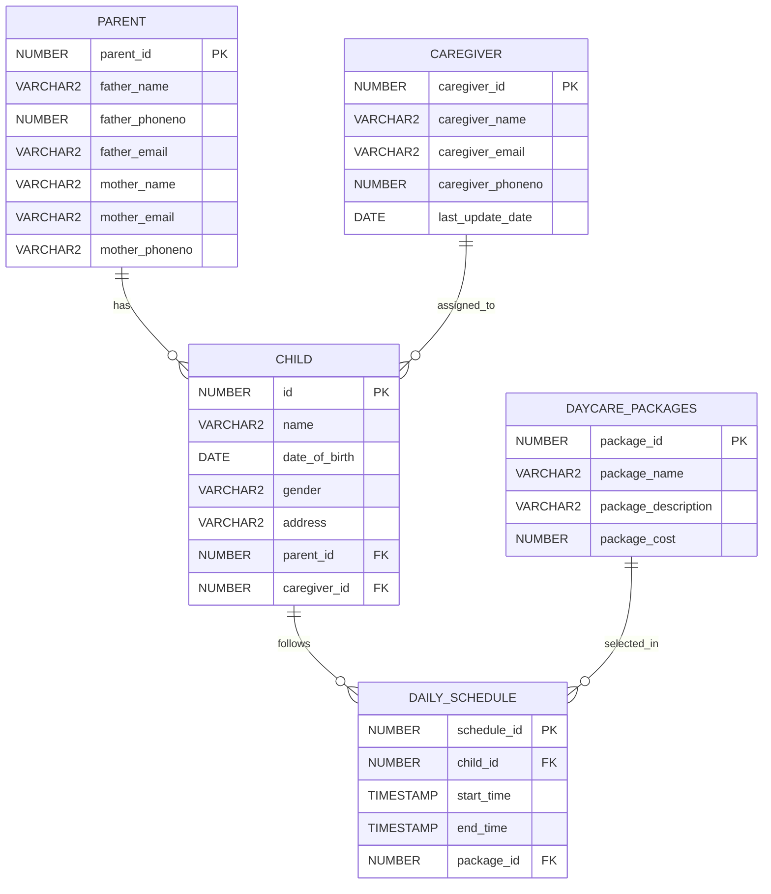

# Daycare Management System - Oracle DBMS Project

A database-focused **Daycare Management System** developed as an academic project for **CSE3110: Database Systems Laboratory**. The project uses **Oracle SQL and PL/SQL** to model and manage daycare packages, caregivers, parents, children, and daily schedules while demonstrating core DBMS concepts such as DDL, DML, joins, subqueries, views, cursors, functions, exception handling, collections, and triggers.

> **Project type:** Academic DBMS Laboratory Project  
> **Course:** CSE3110 - Database Systems Laboratory  
> **Level/Term:** 3-1  
> **Database:** Oracle Database  
> **Languages:** SQL, PL/SQL  
> **Author:** Shaeer Musarrat Swapnil  
> **Roll:** 2007116

---

## Table of Contents

- [Project Overview](#project-overview)
- [Project Objectives](#project-objectives)
- [Technology and Concepts](#technology-and-concepts)
- [Repository Structure](#repository-structure)
- [Database Schema](#database-schema)
- [Entity Relationships](#entity-relationships)
- [Seed Data](#seed-data)
- [DDL Operations](#ddl-operations)
- [DML and Query Operations](#dml-and-query-operations)
- [Views](#views)
- [PLSQL Features](#plsql-features)
- [Users and Stakeholders](#users-and-stakeholders)
- [How to Run the Project](#how-to-run-the-project)
- [Expected Execution Effects](#expected-execution-effects)
- [Important Implementation Notes](#important-implementation-notes)
- [Possible Improvements](#possible-improvements)
- [Project Documentation](#project-documentation)
- [Author](#author)
- [License](#license)

---

# Project Overview

The **Daycare Management System** is an Oracle database project designed to organize the core information required for daycare operations.

The system stores and manages information about:

1. Daycare packages
2. Caregivers
3. Parents/guardians
4. Children
5. Daily schedules
6. Caregiver assignments
7. Package assignments

The project demonstrates both **relational database design** and practical **Oracle database programming**.

The database is centered around five major entities:

- `DaycarePackages`
- `Caregiver`
- `Parent`
- `Child`
- `DailySchedule`

The `Child` table connects children with their parents and assigned caregivers, while `DailySchedule` connects each child with a daycare package and stores their scheduled start and end times.

This repository is primarily a **database implementation project**. It does not currently include a web application, mobile application, desktop GUI, or backend API.

---

# Project Objectives

According to the project documentation, the Daycare Management System was designed with the following objectives.

## 1. Child Records Management

Maintain detailed and up-to-date information about children so that daycare personnel can provide organized and personalized care.

The database stores information such as:

- child name
- date of birth
- gender
- address
- parent information
- assigned caregiver

---

## 2. Caregiver Scheduling and Management

Manage caregiver assignments so that each child can be associated with an appropriate caregiver.

The database connects:

```text
Caregiver
    |
    |
    v
Child
```

through `caregiver_id`.

---

## 3. Parent Interaction Enhancement

Maintain parent/guardian information to support communication between daycare staff and families.

The database stores:

- father's name
- father's phone number
- father's email
- mother's name
- mother's phone number
- mother's email

---

## 4. Operational Efficiency in Child Care

Organize important daycare information using a structured relational database instead of maintaining disconnected records manually.

The system connects:

```text
Parent
   |
   v
Child
   |
   v
DailySchedule
   |
   v
DaycarePackage
```

---

## 5. Attendance and Time Tracking

The `DailySchedule` table records:

- scheduled starting time
- scheduled ending time
- child
- selected daycare package

This provides the foundation for tracking how long children stay at the daycare.

---

## 6. Emergency Response Management

The project aims to make child and parent contact information quickly available when required.

A future version could expand this functionality with:

- emergency contacts
- allergies
- medication details
- blood group
- medical conditions
- doctor information

---

## 7. Flexible and Scalable System Architecture

The relational structure allows additional:

- children
- caregivers
- parents
- daycare packages
- schedules

to be inserted without redesigning the entire database.

---

## 8. Regulatory Compliance and Reporting

Structured database records can help daycare administrators maintain organized information that may later be used for:

- administrative reporting
- enrollment records
- caregiver assignments
- attendance records
- compliance reporting

---

# Technology and Concepts

## Technology Used

- **Oracle Database**
- **Oracle SQL**
- **PL/SQL**
- **Oracle SQL Developer**
- **SQL*Plus-compatible commands**

---

## Database Concepts Demonstrated

This project covers a wide range of concepts taught in a Database Systems Laboratory course.

### Database Design

- Relational database design
- Entity relationships
- Primary keys
- Foreign keys
- Referential integrity

### DDL

- `CREATE TABLE`
- `ALTER TABLE`
- `RENAME COLUMN`
- `ADD COLUMN`
- `MODIFY COLUMN`
- `DROP COLUMN`
- `DROP TABLE`

### DML

- `INSERT`
- `SELECT`
- `UPDATE`
- `DELETE`

### Query Operations

- `WHERE`
- `LIKE`
- `BETWEEN`
- `AND`
- `OR`
- `NOT`
- `IN`

### Advanced Querying

- Nested subqueries
- Common Table Expressions using `WITH`
- Set operations using `UNION`
- Aggregate functions
- `GROUP BY`
- `HAVING`

### Join Operations

- Natural Join
- Inner Join
- Left Outer Join
- Right Outer Join
- Full Outer Join

### Database Objects

- Views
- Functions
- Triggers

### PL/SQL

- Anonymous blocks
- Variables
- `%TYPE`
- Explicit cursors
- Loops
- Conditional statements
- `IF`
- `ELSIF`
- `ELSE`
- `VARRAY`
- Exception handling
- Functions
- Triggers
- `DBMS_OUTPUT`
- `RAISE_APPLICATION_ERROR`

---

# Repository Structure

```text
ChildCare-DBMS-Oracle-master/
│
├── 1_create_table.sql
├── 2_insert.sql
├── 3_DDL.sql
├── 4_DML.sql
├── 5_PL_SQL.sql
└── Daycare Management System.pdf
```

After adding this README:

```text
ChildCare-DBMS-Oracle-master/
│
├── README.md
├── 1_create_table.sql
├── 2_insert.sql
├── 3_DDL.sql
├── 4_DML.sql
├── 5_PL_SQL.sql
└── Daycare Management System.pdf
```

---

# File Descriptions

| File | Description |
|---|---|
| `1_create_table.sql` | Creates the five primary database tables and establishes primary-key and foreign-key relationships. |
| `2_insert.sql` | Inserts the project's sample dataset. |
| `3_DDL.sql` | Demonstrates DDL operations including rename, add, modify, and drop column operations. |
| `4_DML.sql` | Contains SQL queries demonstrating selection, update, deletion, CTEs, aggregates, grouping, subqueries, set operations, joins, logical conditions, and views. |
| `5_PL_SQL.sql` | Contains PL/SQL blocks, cursors, loops, arrays, a function, exception handling, triggers, and trigger test data. |
| `Daycare Management System.pdf` | Complete 13-page academic project documentation including introduction, objectives, schema, diagrams, queries, PL/SQL examples, users, and conclusion. |

---

# Database Schema

The project contains five main tables.

---

## 1. DaycarePackages

Stores information about daycare packages offered by the daycare center.

### Structure

| Column | Data Type | Description |
|---|---|---|
| `package_id` | `NUMBER` | Primary key |
| `package_name` | `VARCHAR2(100)` | Name of package |
| `package_description` | `VARCHAR2(255)` | Description of package |
| `package_cost` | `NUMBER(20)` | Cost of package |

### SQL

```sql
CREATE TABLE DaycarePackages (
    package_id NUMBER PRIMARY KEY,
    package_name VARCHAR2(100),
    package_description VARCHAR2(255),
    package_cost NUMBER(20)
);
```

---

# 2. Caregiver

Stores information about daycare caregivers.

### Initial Structure

| Column | Data Type | Description |
|---|---|---|
| `caregiver_id` | `NUMBER` | Primary key |
| `caregiver_name` | `VARCHAR2(100)` | Name |
| `caregiver_email` | `VARCHAR2(100)` | Email |
| `caregiver_phoneno` | `NUMBER(20)` | Phone number |

### SQL

```sql
CREATE TABLE Caregiver (
    caregiver_id NUMBER PRIMARY KEY,
    caregiver_name VARCHAR2(100),
    caregiver_email VARCHAR2(100),
    caregiver_phoneno NUMBER(20)
);
```

Later, `5_PL_SQL.sql` adds:

```sql
last_update_date DATE
```

The final caregiver structure can therefore contain:

| Column | Description |
|---|---|
| `caregiver_id` | Caregiver identifier |
| `caregiver_name` | Caregiver name |
| `caregiver_email` | Email |
| `caregiver_phoneno` | Phone |
| `last_update_date` | Timestamp of latest modification |

> **Note:** The project report/schema diagram mentions a `caregiver_experience` attribute, but this column is not created in the actual SQL implementation.

---

# 3. Parent

The Parent table originally starts with generic parent information.

### Initial Structure

```sql
CREATE TABLE Parent (
    parent_id NUMBER PRIMARY KEY,
    parent_name VARCHAR2(100),
    parent_phoneno NUMBER(20),
    parent_email VARCHAR2(100)
);
```

Initial columns:

| Column |
|---|
| `parent_id` |
| `parent_name` |
| `parent_phoneno` |
| `parent_email` |

---

## Parent Table Modification

`3_DDL.sql` renames the generic fields.

```sql
ALTER TABLE Parent
RENAME COLUMN parent_name TO father_name;

ALTER TABLE Parent
RENAME COLUMN parent_email TO father_email;

ALTER TABLE Parent
RENAME COLUMN parent_phoneno TO father_phoneno;
```

It then adds:

```sql
ALTER TABLE Parent ADD mother_name VARCHAR(255);
ALTER TABLE Parent ADD mother_email VARCHAR(255);
ALTER TABLE Parent ADD mother_phoneno VARCHAR(255);
```

### Final Parent Structure

| Column | Purpose |
|---|---|
| `parent_id` | Primary key |
| `father_name` | Father's name |
| `father_phoneno` | Father's phone |
| `father_email` | Father's email |
| `mother_name` | Mother's name |
| `mother_email` | Mother's email |
| `mother_phoneno` | Mother's phone |

The DDL file additionally creates a temporary demonstration column:

```sql
columnn VARCHAR(255)
```

and later removes it.

---

# 4. Child

Stores the information of every enrolled child.

### Structure

| Column | Data Type | Key |
|---|---|---|
| `id` | `NUMBER` | Primary Key |
| `name` | `VARCHAR2(100)` | |
| `date_of_birth` | `DATE` | |
| `gender` | `VARCHAR(20)` | |
| `address` | `VARCHAR2(255)` | |
| `parent_id` | `NUMBER(20)` | Foreign Key |
| `caregiver_id` | `NUMBER(20)` | Foreign Key |

### SQL

```sql
CREATE TABLE Child (
    id NUMBER PRIMARY KEY,
    name VARCHAR2(100),
    date_of_birth DATE,
    gender VARCHAR(20),
    address VARCHAR2(255),
    parent_id NUMBER(20),
    caregiver_id NUMBER(20),

    FOREIGN KEY (parent_id)
        REFERENCES Parent(parent_id),

    FOREIGN KEY (caregiver_id)
        REFERENCES Caregiver(caregiver_id)
);
```

### Foreign Keys

```text
Child.parent_id
      |
      v
Parent.parent_id
```

and

```text
Child.caregiver_id
      |
      v
Caregiver.caregiver_id
```

> The PDF documentation sometimes calls the Child primary key `child_id`. In the executable SQL implementation its name is `id`.

---

# 5. DailySchedule

Stores the daycare schedule and package assignment of children.

### Structure

| Column | Data Type | Description |
|---|---|---|
| `schedule_id` | `NUMBER(20)` | Primary key |
| `child_id` | `NUMBER(20)` | Foreign key |
| `start_time` | `TIMESTAMP` | Starting time |
| `end_time` | `TIMESTAMP` | Ending time |
| `package_id` | `NUMBER(20)` | Foreign key |

### SQL

```sql
CREATE TABLE DailySchedule (
    schedule_id NUMBER(20) PRIMARY KEY,
    child_id NUMBER(20),
    start_time TIMESTAMP,
    end_time TIMESTAMP,
    package_id NUMBER,

    FOREIGN KEY (child_id)
        REFERENCES Child(id),

    FOREIGN KEY (package_id)
        REFERENCES DaycarePackages(package_id)
);
```

`3_DDL.sql` later modifies:

```sql
ALTER TABLE DailySchedule
MODIFY package_id NUMBER(20);
```

---

# Entity Relationships

The database contains four major relationships.

## Parent to Child

```text
Parent
  1
  |
  |
  N
Child
```

A parent record may be connected with multiple child records.

---

## Caregiver to Child

```text
Caregiver
   1
   |
   |
   N
 Child
```

A caregiver may care for multiple children.

---

## Child to DailySchedule

```text
Child
  1
  |
  |
  N
DailySchedule
```

The database allows multiple schedules for a child because `DailySchedule.child_id` is not unique.

---

## DaycarePackage to DailySchedule

```text
DaycarePackages
      1
      |
      |
      N
DailySchedule
```

A package can be selected by multiple scheduled children.

---

# ER Diagram

The implemented schema can be represented as:



---

# Seed Data

`2_insert.sql` populates the database with sample records.

## Initial Record Counts

| Table | Records |
|---|---:|
| `DaycarePackages` | 5 |
| `Caregiver` | 10 |
| `Parent` | 20 |
| `Child` | 20 |
| `DailySchedule` | 20 |

Total initial inserted records:

```text
5 + 10 + 20 + 20 + 20 = 75 records
```

---

# Daycare Package Data

| ID | Package | Description | Cost |
|---:|---|---|---:|
| 1 | Basic | Basic childcare | 3000 |
| 2 | Extended | Extended care with additional activities | 4000 |
| 3 | Half-Day | Morning or afternoon only | 2000 |
| 4 | Full Day | Full day care | 4000 |
| 5 | Night Care | Overnight care for parents working night shifts | 3000 |

> No currency is defined for `package_cost` in the SQL schema.

---

# Caregiver Seed Data

The database contains ten initial caregivers:

1. Swapnil
2. Mim
3. Mayesha
4. Shipra
5. Iqbal
6. Razon
7. Prova
8. Samiha
9. Azmain
10. Hafsa

---

# Child Seed Data

The initial twenty children are:

1. Arpita
2. Rohan
3. Rahin
4. Nubah
5. Dipro
6. Avro
7. Rafid
8. Sajid
9. Ramin
10. Mehzabin
11. Nahar
12. Kotha
13. Oishee
14. Tasfia
15. Faija
16. Tazrian
17. Hanium
18. Maria
19. Joli
20. Tazwar

Each initial child has:

- a parent
- an assigned caregiver
- a schedule
- a daycare package through `DailySchedule`

---

# Initial Package Assignments

The initial 20 schedule records use package IDs:

```text
Package 1 -> 5 children
Package 2 -> 5 children
Package 3 -> 5 children
Package 4 -> 5 children
Package 5 -> 0 children
```

Therefore, `Night Care` exists in the package table but is not assigned to any of the initial twenty schedules.

---

# Schedule Data

All initial schedule records use:

```text
2024-05-01
```

Example schedule ranges include:

```text
08:00 - 16:00
09:00 - 17:00
07:30 - 15:30
10:00 - 18:00
08:30 - 16:30
10:30 - 18:30
```

---

# DDL Operations

DDL demonstrations are available in:

```text
3_DDL.sql
```

---

## Rename Columns

```sql
ALTER TABLE Parent
RENAME COLUMN parent_name TO father_name;

ALTER TABLE Parent
RENAME COLUMN parent_email TO father_email;

ALTER TABLE Parent
RENAME COLUMN parent_phoneno TO father_phoneno;
```

---

## Add Columns

```sql
ALTER TABLE Parent ADD mother_name VARCHAR(255);

ALTER TABLE Parent ADD mother_email VARCHAR(255);

ALTER TABLE Parent ADD mother_phoneno VARCHAR(255);
```

A temporary column is also added:

```sql
ALTER TABLE Parent ADD columnn VARCHAR(255);
```

---

## Modify Column

```sql
ALTER TABLE DailySchedule
MODIFY package_id NUMBER(20);
```

---

## Drop Column

```sql
ALTER TABLE Parent
DROP COLUMN columnn;
```

---

## SQL*Plus Output Formatting

The DDL script additionally contains:

```sql
SET PAGESIZE 100
SET LINESIZE 200

SHOW PAGESIZE
SHOW LINESIZE
```

---

# DML and Query Operations

The file:

```text
4_DML.sql
```

contains the main SQL query demonstrations.

---

# Basic SELECT Queries

All core tables can be displayed with:

```sql
SELECT * FROM DaycarePackages;

SELECT * FROM Parent;

SELECT * FROM Caregiver;

SELECT * FROM Child;

SELECT * FROM DailySchedule;
```

---

# Filtering Package Data

Example:

```sql
SELECT *
FROM DaycarePackages
WHERE package_cost = 150.00;
```

---

# Filtering Children by Caregiver

```sql
SELECT *
FROM Child
WHERE caregiver_id = 2;
```

---

# Nested Package Query

The project demonstrates retrieving children associated with a package using nested subqueries.

Example:

```sql
SELECT *
FROM Child
WHERE id IN
(
    SELECT child_id
    FROM DailySchedule
    WHERE package_id =
    (
        SELECT package_id
        FROM DaycarePackages
        WHERE package_name = 'Premium Care'
    )
);
```

---

# UPDATE Operations

The project demonstrates changing a daycare package name:

```sql
UPDATE DaycarePackages
SET package_name = 'Standard Care'
WHERE package_name = 'Basic';
```

It also updates a caregiver's phone number:

```sql
UPDATE Caregiver
SET caregiver_phoneno = 9876543260
WHERE caregiver_id = 1;
```

---

# INSERT and DELETE

The project inserts a temporary Parent record:

```sql
INSERT INTO Parent (...)
VALUES (...);
```

using:

```text
parent_id = 21
```

and then deletes it:

```sql
DELETE FROM Parent
WHERE parent_id = 21;
```

This demonstrates row deletion.

---

# UNION

Example:

```sql
SELECT package_name
FROM DaycarePackages
WHERE package_name LIKE 'B%'

UNION

SELECT package_name
FROM DaycarePackages
WHERE package_name LIKE '%Care%';
```

`UNION` combines the results and removes duplicate rows.

Another `UNION` is demonstrated with caregiver names.

---

# WITH Clause / Common Table Expression

The project calculates the maximum package cost using:

```sql
WITH MaxCost(cost) AS
(
    SELECT MAX(package_cost)
    FROM DaycarePackages
)
SELECT *
FROM DaycarePackages, MaxCost
WHERE DaycarePackages.package_cost = MaxCost.cost;
```

---

# Aggregate Functions

The project demonstrates multiple aggregate functions.

## COUNT

```sql
SELECT COUNT(*)
FROM Caregiver;
```

---

## COUNT non-null values

```sql
SELECT COUNT(caregiver_name)
AS number_of_caregivers
FROM Caregiver;
```

---

## COUNT DISTINCT

```sql
SELECT COUNT(DISTINCT package_name)
AS number_of_packages
FROM DaycarePackages;
```

---

## AVG

```sql
SELECT AVG(package_cost)
FROM DaycarePackages;
```

---

## SUM

```sql
SELECT SUM(package_cost)
FROM DaycarePackages;
```

---

## MAX

```sql
SELECT MAX(package_cost)
AS highest_cost
FROM DaycarePackages;
```

---

## MIN

```sql
SELECT MIN(package_cost)
AS lowest_cost
FROM DaycarePackages;
```

---

# GROUP BY

The project demonstrates grouping schedule information based on package.

It also calculates the number of children assigned to caregivers.

```sql
SELECT caregiver_id,
       COUNT(*) AS num_children
FROM Child
GROUP BY caregiver_id;
```

---

# HAVING

The project identifies caregivers handling more than the average number of children.

```sql
SELECT caregiver_id,
       COUNT(*) AS num_children
FROM Child
GROUP BY caregiver_id
HAVING COUNT(*) >
(
    SELECT AVG(child_count)
    FROM
    (
        SELECT caregiver_id,
               COUNT(*) AS child_count
        FROM Child
        GROUP BY caregiver_id
    )
);
```

---

# Nested Subqueries

Example:

```sql
SELECT name
FROM Child
WHERE id IN
(
    SELECT child_id
    FROM DailySchedule
    WHERE package_id =
    (
        SELECT package_id
        FROM DaycarePackages
        WHERE package_name = 'Extended'
    )
);
```

This retrieves children associated with the `Extended` package.

---

# AND Operator

Example:

```sql
SELECT *
FROM Child
WHERE caregiver_id = 2
AND date_of_birth BETWEEN
    TO_DATE('2016-01-01', 'YYYY-MM-DD')
AND
    TO_DATE('2018-01-01', 'YYYY-MM-DD');
```

---

# OR Operator

The project demonstrates combining caregiver conditions and package-related conditions using `OR`.

---

# NOT Operator

Example:

```sql
SELECT *
FROM Child
WHERE NOT (caregiver_id = 3)
AND NOT (address LIKE '%Khulna%');
```

---

# Complex Logical Conditions

The project combines:

- `AND`
- `OR`
- `NOT`
- `BETWEEN`
- `LIKE`

in the same query.

This demonstrates complex SQL filtering.

---

# Join Operations

The project demonstrates multiple types of joins using the `Parent` and `Child` tables.

---

## Natural Join

```sql
SELECT *
FROM Child
NATURAL JOIN Parent;
```

---

## Inner Join with USING

```sql
SELECT father_name AS parent_name,
       name AS child_name
FROM Parent
JOIN Child
USING(parent_id);
```

---

## Inner Join with ON

```sql
SELECT Parent.father_name AS parent_name,
       Child.name AS child_name
FROM Parent
JOIN Child
ON Parent.parent_id = Child.parent_id;
```

---

## Left Outer Join

```sql
SELECT father_name AS parent_name,
       name AS child_name
FROM Parent
LEFT OUTER JOIN Child
USING(parent_id);
```

---

## Right Outer Join

```sql
SELECT father_name AS parent_name,
       name AS child_name
FROM Parent
RIGHT OUTER JOIN Child
USING(parent_id);
```

---

## Full Outer Join

```sql
SELECT father_name AS parent_name,
       name AS child_name
FROM Parent
FULL OUTER JOIN Child
USING(parent_id);
```

Both `USING` and explicit `ON` syntax are demonstrated.

---

# Views

Three database views are created.

---

## 1. DaycarePackageDetails

```sql
CREATE OR REPLACE VIEW DaycarePackageDetails AS
SELECT
    package_id,
    package_name,
    package_description,
    package_cost
FROM DaycarePackages;
```

Query:

```sql
SELECT *
FROM DaycarePackageDetails;
```

---

## 2. ParentDetails

```sql
CREATE OR REPLACE VIEW ParentDetails AS
SELECT
    parent_id,
    father_name,
    mother_name,
    father_phoneno,
    mother_phoneno,
    father_email,
    mother_email
FROM Parent;
```

Query:

```sql
SELECT *
FROM ParentDetails;
```

---

## 3. CustomParentDetails

```sql
CREATE OR REPLACE VIEW CustomParentDetails AS
SELECT *
FROM ParentDetails
WHERE parent_id >= 3;
```

Query:

```sql
SELECT *
FROM CustomParentDetails;
```

---

# PLSQL Features

PL/SQL demonstrations are available in:

```text
5_PL_SQL.sql
```

---

# 1. Insert Child Using PL/SQL Variables

The first PL/SQL block creates variables using `%TYPE`.

```sql
DECLARE

    v_child_id Child.id%TYPE := 21;

    v_child_name Child.name%TYPE := 'Musu';

    v_date_of_birth Child.date_of_birth%TYPE :=
        TO_DATE('2015-06-01', 'YYYY-MM-DD');

    v_gender Child.gender%TYPE := 'M';

    v_address Child.address%TYPE := 'Teligati';

    v_parent_id Child.parent_id%TYPE := 1;

    v_caregiver_id Child.caregiver_id%TYPE := 1;

BEGIN

    INSERT INTO Child
    (
        id,
        name,
        date_of_birth,
        gender,
        address,
        parent_id,
        caregiver_id
    )

    VALUES
    (
        v_child_id,
        v_child_name,
        v_date_of_birth,
        v_gender,
        v_address,
        v_parent_id,
        v_caregiver_id
    );

END;
/
```

The block inserts:

```text
ID          : 21
Name        : Musu
Date of Birth: 2015-06-01
Gender      : M
Address     : Teligati
Parent ID   : 1
Caregiver ID: 1
```

---

# 2. Cursor - Caregivers and Packages

The project declares an explicit cursor joining:

```text
Caregiver
   |
Child
   |
DailySchedule
   |
DaycarePackages
```

The query is:

```sql
SELECT
    cg.caregiver_id,
    cg.caregiver_name,
    dp.package_name
FROM Caregiver cg
JOIN Child ch
    ON cg.caregiver_id = ch.caregiver_id
JOIN DailySchedule ds
    ON ch.id = ds.child_id
JOIN DaycarePackages dp
    ON ds.package_id = dp.package_id;
```

The cursor then prints information using:

```sql
DBMS_OUTPUT.PUT_LINE(...)
```

---

# 3. Cursor - Caregivers and Children

Another explicit cursor retrieves:

```text
caregiver ID
caregiver name
child name
```

using the relationship:

```text
Caregiver -> Child
```

The cursor is processed using:

```sql
OPEN
FETCH
LOOP
EXIT WHEN
CLOSE
```

This demonstrates explicit cursor handling.

---

# 4. Package Cost Update

A PL/SQL block executes:

```sql
UPDATE DaycarePackages
SET package_cost = package_cost * 1.1
WHERE package_cost < 2000;
```

It then prints:

```text
Daycare package costs updated.
```

using:

```sql
DBMS_OUTPUT.PUT_LINE
```

With the original seed data, the minimum package cost is exactly:

```text
2000
```

Therefore:

```sql
package_cost < 2000
```

initially matches no rows.

---

# 5. VARRAY

The project demonstrates an Oracle `VARRAY`.

```sql
TYPE CHILDARRAY IS
VARRAY(5) OF Child.name%TYPE;
```

The array contains:

```text
Arpita
Rohan
Rahin
Nubah
Dipro
```

---

# IF / ELSIF / ELSE

The program retrieves each child's caregiver and checks the caregiver name.

Example logic:

```sql
IF caregiver_name = 'Swapnil' THEN

    ...

ELSIF caregiver_name = 'Mim' THEN

    ...

ELSE

    ...

END IF;
```

This demonstrates PL/SQL conditional control flow.

---

# FOR Loop

The VARRAY is traversed using:

```sql
FOR x IN 1..5
LOOP

    ...

END LOOP;
```

---

# 6. User-Defined Function

The project creates:

```text
GetChildName
```

Function declaration:

```sql
CREATE OR REPLACE FUNCTION GetChildName
(
    child_id IN NUMBER
)
RETURN VARCHAR2
```

Its purpose is to return the name of a child for a supplied child ID.

Example:

```sql
SELECT name
INTO child_name_value
FROM Child
WHERE id = child_id;
```

---

# Exception Handling

The function handles:

```sql
NO_DATA_FOUND
```

with:

```sql
RETURN 'No child found';
```

It also includes:

```sql
WHEN OTHERS THEN
    RAISE;
```

to re-raise unexpected errors.

---

# Function Test

The function is tested using child ID:

```text
1
```

Example:

```sql
child_name := GetChildName(1);
```

and the result is printed with:

```sql
DBMS_OUTPUT.PUT_LINE
```

---

# 7. Caregiver Capacity Trigger

One of the most important database-programming features in the project is:

```text
trg_check_caregiver_capacity
```

The trigger is defined as:

```sql
BEFORE INSERT ON Child
FOR EACH ROW
```

It counts how many children are already assigned to the caregiver.

Maximum capacity:

```text
5 children
```

Logic:

```text
New Child
    |
    v
Read caregiver_id
    |
    v
Count existing children
    |
    v
Is count >= 5?
   / \
 Yes  No
  |    |
Reject Allow
```

If the caregiver already has five children:

```sql
RAISE_APPLICATION_ERROR
(
    -20001,
    'This caregiver has reached their maximum capacity.'
);
```

---

# Trigger Test Data

The script attempts to insert additional children with IDs:

```text
22
23
24
25
26
27
```

These records are used to demonstrate the caregiver-capacity trigger.

Some inserts can intentionally fail after the selected caregiver reaches the maximum limit of five children.

---

# 8. Caregiver Last Update Trigger

The PL/SQL script adds a new column:

```sql
ALTER TABLE Caregiver
ADD last_update_date DATE;
```

It then creates:

```text
trg_upd_caregiver_last_upd
```

The trigger runs:

```sql
BEFORE UPDATE ON Caregiver
FOR EACH ROW
```

and performs:

```sql
:NEW.last_update_date := SYSDATE;
```

Therefore, whenever a caregiver record is modified, Oracle automatically records the update date.

---

# Trigger Test

Caregiver ID 1 is updated:

```sql
UPDATE Caregiver
SET caregiver_email = 'newemail@example.com'
WHERE caregiver_id = 1;
```

The trigger automatically sets:

```text
last_update_date
```

to the current Oracle database date/time.

The modified caregiver is then displayed using:

```sql
SELECT *
FROM Caregiver
WHERE caregiver_id = 1;
```

---

# Users and Stakeholders

The project report identifies five main user/stakeholder groups.

---

## 1. Daycare Administrators

Administrators may use the database to manage:

- children
- caregivers
- packages
- schedules
- enrollment information
- operational records

---

## 2. Caregivers and Teachers

Caregivers can use child and schedule information to understand:

- which children they are responsible for
- child information
- daycare times
- daycare packages

---

## 3. Parents

Parents/guardians are important stakeholders because their information is connected with the enrolled child.

Potential future interfaces could allow parents to:

- register children
- view schedules
- receive updates
- communicate with caregivers

---

## 4. Healthcare Professionals

The report identifies healthcare professionals as potential stakeholders.

Future implementations could include:

- child health information
- medical history
- emergency information
- allergy information

These modules are not currently implemented in the SQL schema.

---

## 5. Regulatory Bodies

Structured daycare data could potentially support:

- record auditing
- safety monitoring
- regulatory compliance
- administrative reporting

Dedicated regulatory tables and access-control systems are not currently implemented.

---

# Database Integrity

The current schema enforces integrity primarily using:

## Primary Keys

```text
DaycarePackages.package_id
Caregiver.caregiver_id
Parent.parent_id
Child.id
DailySchedule.schedule_id
```

---

## Foreign Keys

```text
Child.parent_id
    -> Parent.parent_id
```

```text
Child.caregiver_id
    -> Caregiver.caregiver_id
```

```text
DailySchedule.child_id
    -> Child.id
```

```text
DailySchedule.package_id
    -> DaycarePackages.package_id
```

---

# Database Flow

A simplified data flow is:

```text
              +----------------+
              |     Parent     |
              +--------+-------+
                       |
                       |
                       v
              +----------------+
              |      Child     |
              +---+--------+---+
                  |        |
                  |        |
        +---------+        +----------+
        |                             |
        v                             v
+---------------+             +---------------+
|   Caregiver   |             | DailySchedule |
+---------------+             +-------+-------+
                                      |
                                      |
                                      v
                              +---------------+
                              |DaycarePackages|
                              +---------------+
```

---

# How to Run the Project

## Prerequisites

You need:

- Oracle Database
- Oracle SQL Developer, SQL*Plus, or SQLcl
- An Oracle user/schema
- Permission to create tables
- Permission to create views
- Permission to create functions
- Permission to create triggers

---

# Important Execution Order

Although the files are named:

```text
1_create_table.sql
2_insert.sql
3_DDL.sql
4_DML.sql
5_PL_SQL.sql
```

they should **not** be executed exactly in that order when initializing the database.

The reason is that `2_insert.sql` inserts values into:

```text
father_name
father_phoneno
father_email
mother_name
mother_email
mother_phoneno
```

but those columns are only created/renamed by:

```text
3_DDL.sql
```

Therefore the recommended order is:

```text
1_create_table.sql
        ↓
3_DDL.sql
        ↓
2_insert.sql
        ↓
4_DML.sql
        ↓
5_PL_SQL.sql
```

In short:

```text
1 → 3 → 2 → 4 → 5
```

---

# Oracle SQL Developer Setup

## Step 1

Open Oracle SQL Developer.

---

## Step 2

Connect to your Oracle database account.

---

## Step 3

Open:

```text
1_create_table.sql
```

and execute the script.

This creates:

```text
DaycarePackages
Caregiver
Parent
Child
DailySchedule
```

---

## Step 4

Run:

```text
3_DDL.sql
```

This prepares the final Parent structure required by the insert file.

---

## Step 5

Run:

```text
2_insert.sql
```

This inserts the initial sample dataset.

---

## Step 6

Commit the data if necessary.

```sql
COMMIT;
```

---

## Step 7

Run:

```text
4_DML.sql
```

to test:

- queries
- updates
- delete operations
- joins
- aggregate functions
- nested queries
- grouping
- views

---

## Step 8

Run:

```text
5_PL_SQL.sql
```

to test:

- PL/SQL blocks
- cursors
- arrays
- conditions
- function
- exceptions
- triggers

---

## Step 9

Enable:

```sql
SET SERVEROUTPUT ON;
```

to display output from:

```sql
DBMS_OUTPUT.PUT_LINE
```

---

# SQL*Plus / SQLcl Execution

From the project directory, the scripts can be executed as:

```sql
@1_create_table.sql
@3_DDL.sql
@2_insert.sql

COMMIT;

@4_DML.sql
@5_PL_SQL.sql
```

---

# Expected Execution Effects

It is important to understand that:

```text
4_DML.sql
```

and

```text
5_PL_SQL.sql
```

are **not read-only files**.

They modify database contents.

---

## Effects of 4_DML.sql

It can change:

```text
Basic
```

to:

```text
Standard Care
```

using:

```sql
UPDATE DaycarePackages
SET package_name = 'Standard Care'
WHERE package_name = 'Basic';
```

---

It updates caregiver ID 1's phone number.

---

It inserts and subsequently deletes:

```text
Parent ID 21
```

---

It creates:

```text
DaycarePackageDetails
ParentDetails
CustomParentDetails
```

views.

---

# Effects of 5_PL_SQL.sql

The file can:

- insert child ID 21 (`Musu`)
- create caregiver/package cursor logic
- create caregiver/child cursor logic
- execute package-cost update logic
- demonstrate VARRAY
- demonstrate conditional statements
- create `GetChildName`
- create caregiver capacity trigger
- attempt additional child inserts
- add `last_update_date`
- create caregiver update trigger
- update caregiver ID 1's email

---

# Important Implementation Notes

There are several details in the original project files that anyone running or maintaining the repository should know.

---

## 1. Insert Script Depends on DDL Script

`2_insert.sql` cannot correctly insert the Parent records immediately after the original `CREATE TABLE Parent`.

The insert script expects:

```text
father_name
father_phoneno
father_email
mother_name
mother_email
mother_phoneno
```

Therefore:

```text
3_DDL.sql
```

must run before:

```text
2_insert.sql
```

---

## 2. DROP Statements on First Execution

`1_create_table.sql` starts with:

```sql
DROP TABLE DaycarePackages;
DROP TABLE Caregiver;
DROP TABLE Parent;
DROP TABLE Child;
DROP TABLE DailySchedule;
```

On a completely fresh Oracle schema, Oracle may report errors because these tables do not yet exist.

If script execution continues, the later `CREATE TABLE` statements can still create the schema.

---

## 3. DROP Order on Existing Schema

The original drop order is not dependency-safe.

The foreign-key relationships mean dependent tables should normally be dropped first.

A safer conceptual order is:

```text
DailySchedule
     ↓
Child
     ↓
Parent / Caregiver / DaycarePackages
```

Alternatively, an Oracle reset script can use an appropriate:

```sql
CASCADE CONSTRAINTS
```

strategy.

---

## 4. Non-Existing caregiver_id in DaycarePackages Query

One statement in `4_DML.sql` attempts to retrieve:

```text
caregiver_id
```

from:

```text
DaycarePackages
```

However, `DaycarePackages` does not have a `caregiver_id` column.

Its columns are:

```text
package_id
package_name
package_description
package_cost
```

Therefore that particular query is inconsistent with the implemented schema.

---

## 5. package_cost = 150 Query

One demonstration query searches for:

```sql
package_cost = 150.00
```

but the seed package costs are:

```text
2000
3000
4000
```

Therefore the query returns no rows from the initial dataset.

---

## 6. Premium Care Query

A demonstration query searches for:

```text
Premium Care
```

but the package seed data contains:

```text
Basic
Extended
Half-Day
Full Day
Night Care
```

Therefore no initial package is named `Premium Care`.

The SQL statement can execute, but the nested query will not find a matching initial package.

---

## 7. Child ID Naming

The report occasionally describes:

```text
child_id
```

as the primary key of `Child`.

The SQL implementation uses:

```text
id
```

as the actual Child primary key.

The `DailySchedule` table uses:

```text
child_id
```

as the foreign key referencing:

```text
Child.id
```

---

## 8. caregiver_experience Difference

The conceptual schema in the PDF mentions:

```text
caregiver_experience
```

but `1_create_table.sql` does not create this attribute.

Therefore the executable SQL schema should be treated as the authoritative implementation.

---

## 9. Package Update Condition

The PL/SQL file contains:

```sql
WHERE package_cost < 2000
```

for the 10% increase.

However, the minimum original package cost is:

```text
2000
```

Therefore the original data produces zero affected rows.

---

## 10. Caregiver Capacity Errors Are Intentional

The trigger limits caregivers to:

```text
5 children
```

Some demonstration inserts can therefore generate:

```text
ORA-20001:
This caregiver has reached their maximum capacity.
```

This demonstrates that the trigger is successfully enforcing the business rule.

---

## 11. PL/SQL `/` Terminators

PL/SQL blocks executed through:

- SQL*Plus
- SQLcl
- SQL Developer Run Script

normally require:

```text
/
```

after each block.

The first caregiver/package cursor block in `5_PL_SQL.sql` should be checked because it ends with:

```sql
END;
```

before the next PL/SQL section.

If necessary, add:

```sql
/
```

after that block when running it as a script.

---

## 12. Re-running 5_PL_SQL.sql

Re-running the complete PL/SQL file without resetting the database can cause expected errors.

For example:

```sql
ALTER TABLE Caregiver
ADD last_update_date DATE;
```

will fail if the column already exists.

Likewise, attempts to reinsert child IDs such as:

```text
21
22
23
24
25
26
27
```

may cause duplicate primary-key errors.

---

## 13. Transaction Control

The project insert and update files do not consistently contain explicit:

```sql
COMMIT;
```

statements.

If you want changes to remain after ending a session, execute:

```sql
COMMIT;
```

when appropriate.

---

# Current Database Constraints

The project currently uses:

- Primary Key constraints
- Foreign Key constraints
- Trigger-based caregiver capacity validation

However, additional production-level constraints are not included.

For example, the current schema does not enforce:

- non-null child names
- non-null package names
- unique caregiver emails
- unique parent emails
- positive package costs
- gender domain validation
- start time before end time
- valid email format
- valid phone format

---

# Possible Improvements

The project can be extended significantly.

---

## Database Improvements

### Add NOT NULL Constraints

Important fields such as:

```text
child name
parent name
package name
caregiver name
```

could be required.

---

## Add CHECK Constraints

Examples:

```text
package_cost > 0
```

```text
end_time > start_time
```

and valid gender values.

---

## Use VARCHAR2 for Phone Numbers

Phone numbers are identifiers rather than mathematical numbers.

A future design could use:

```sql
VARCHAR2(...)
```

instead of:

```sql
NUMBER
```

for telephone numbers.

---

## Add Caregiver Experience

Because it exists in the conceptual schema, a future version could add:

```text
caregiver_experience
```

to the actual database.

---

## Add Caregiver Capacity Column

Instead of hardcoding:

```text
5
```

inside the trigger, each caregiver could have an individual:

```text
maximum_capacity
```

value.

---

## Use Oracle Sequences or Identity Columns

Currently IDs are manually supplied.

Future versions could use:

```text
IDENTITY
```

or Oracle:

```text
SEQUENCE
```

objects.

---

## Add Attendance Table

Example concept:

```text
Attendance
----------
attendance_id
child_id
attendance_date
check_in
check_out
status
```

---

## Add Emergency Contact Information

Possible attributes:

```text
emergency_contact_name
emergency_contact_phone
relationship
```

---

## Add Medical Information

Possible information:

- allergies
- medications
- blood group
- medical conditions
- doctor contact information

---

## Add Activity Tracking

A future table could store:

```text
Activity
--------
activity_id
child_id
activity_name
activity_date
notes
```

---

## Add Parent-Caregiver Communication

Possible table:

```text
Message
-------
message_id
parent_id
caregiver_id
message_text
sent_time
```

---

## Add Billing System

Possible entities:

```text
Payment
Invoice
Subscription
BillingHistory
```

---

## Add Authentication

Future users could include:

```text
Administrator
Caregiver
Parent
```

with secure login and role-based permissions.

---

## Add Audit Logging

Important changes could be stored in an audit table rather than only storing the latest caregiver update date.

---

## Add Indexes

Indexes could be added to commonly joined columns such as:

```text
Child.parent_id
Child.caregiver_id
DailySchedule.child_id
DailySchedule.package_id
```

---

## Normalize Address and Contact Information

For a larger system, addresses and contact information could be separated into additional normalized tables.

---

## Consistent Naming

A future version could use a consistent primary-key convention such as:

```text
child_id
parent_id
caregiver_id
package_id
schedule_id
```

instead of using:

```text
Child.id
```

while other entities use entity-specific IDs.

---

## Add Backend and User Interface

The Oracle database could later be connected to:

- Java
- Spring Boot
- Node.js
- PHP
- Python
- Django
- .NET

with a:

- web frontend
- mobile frontend
- desktop frontend

---

# Project Documentation

The repository includes:

```text
Daycare Management System.pdf
```

The PDF contains **13 pages** of project documentation.

It covers:

1. Project title and author information
2. Introduction
3. Project overview
4. Importance of database management in daycare
5. Project objectives
6. Database schema
7. Table relationships
8. Schema diagram
9. ER diagram
10. SQL query examples
11. PL/SQL examples
12. Users of daycare database management
13. Conclusion

The PDF provides the conceptual and academic explanation of the project.

The `.sql` files should be treated as the authoritative source for the exact executable database implementation.

---

# Key Features Summary

| Feature | Implemented |
|---|:---:|
| Daycare package management | ✅ |
| Caregiver records | ✅ |
| Parent records | ✅ |
| Child records | ✅ |
| Daily schedules | ✅ |
| Caregiver-child relationship | ✅ |
| Parent-child relationship | ✅ |
| Package assignment | ✅ |
| Primary keys | ✅ |
| Foreign keys | ✅ |
| Sample dataset | ✅ |
| DDL operations | ✅ |
| DML operations | ✅ |
| Nested queries | ✅ |
| Aggregate functions | ✅ |
| GROUP BY | ✅ |
| HAVING | ✅ |
| UNION | ✅ |
| CTE / WITH | ✅ |
| Natural Join | ✅ |
| Inner Join | ✅ |
| Left Outer Join | ✅ |
| Right Outer Join | ✅ |
| Full Outer Join | ✅ |
| Views | ✅ |
| PL/SQL variables | ✅ |
| `%TYPE` | ✅ |
| Explicit cursors | ✅ |
| Loops | ✅ |
| VARRAY | ✅ |
| Conditional statements | ✅ |
| User-defined function | ✅ |
| Exception handling | ✅ |
| Capacity trigger | ✅ |
| Update-date trigger | ✅ |
| DBMS_OUTPUT | ✅ |
| Attendance-specific table | ❌ |
| Medical records | ❌ |
| Billing/payment module | ❌ |
| Authentication | ❌ |
| Role-based access | ❌ |
| Parent messaging | ❌ |
| Application UI | ❌ |
| Backend API | ❌ |

---

# Learning Outcomes

Through this project, the following Database Systems Laboratory topics are demonstrated:

- designing relational schemas
- converting real-world entities into tables
- creating primary and foreign keys
- maintaining referential integrity
- inserting relational data
- modifying table structures
- retrieving database information
- using logical operators
- creating nested queries
- using aggregate functions
- grouping records
- filtering groups
- joining related tables
- creating views
- writing PL/SQL programs
- using Oracle cursors
- using PL/SQL collections
- implementing procedural logic
- creating database functions
- handling exceptions
- implementing business rules with triggers
- automatically recording update information

---

# Academic Context

This project was developed for:

**CSE3110 - Database Systems Laboratory**

Level/Term:

**3-1**

The project focuses on applying theoretical DBMS concepts to a realistic daycare-management scenario using Oracle Database.

---

# Author

**Shaeer Musarrat Swapnil**

**Roll:** 2007116

**Course:** CSE3110 - Database Systems Laboratory

**Project:** Daycare Management System

---

# License

No software license file is currently included in the project archive.

If this repository is intended for public reuse or collaboration, an appropriate license can be added in the future.

---

## Final Note

This project demonstrates the implementation of a relational **Daycare Management System using Oracle SQL and PL/SQL**. It combines database design, data manipulation, advanced querying, views, procedural database programming, functions, cursors, and triggers in a single academic DBMS project.

The database provides a strong foundation that can later be expanded into a complete daycare-management application with authentication, attendance management, healthcare information, billing, parent communication, and a graphical user interface.
